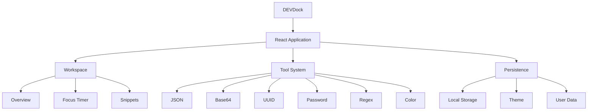

<div align="center">


<br>


<br><br>

<p>
  <a href="https://faizan-khan144.github.io/devdock/">
    
  </a>
  <a href="https://github.com/Faizan-khan144/devdock">
    
  </a>
</p>

<p>
  
  
  
  
</p>

<br>

> **One workspace for the developer tools you use every day.**

</div>

---

<div align="center">

### ◈ THE DEVELOPER COMMAND CENTER ◈

```text
┌──────────────────────────────────────────────────────────────────────┐
│  faizan@devdock ~ $ launch workspace                                │
├──────────────────────────────────────────────────────────────────────┤
│                                                                      │
│   BUILD                 DEBUG                  FOCUS                 │
│                                                                      │
│   JSON                  REGEX                  TIMER                 │
│   UUID                  BASE64                 SNIPPETS              │
│   COLOR                 PASSWORD               WORKFLOW              │
│                                                                      │
│                         ┌──────────────┐                             │
│                         │   DEVDock    │                             │
│                         │   ONLINE ✓   │                             │
│                         └──────────────┘                             │
│                                                                      │
│   $ tools ready                $ workspace ready                    │
│   $ productivity mode          $ ship something                     │
│                                                                      │
└──────────────────────────────────────────────────────────────────────┘
```

</div>

---

## ⚡ What is DevDock?

**DevDock** is a focused browser-based developer workspace built to keep useful development utilities in one place.

Instead of opening multiple websites whenever I need to test JSON, encode Base64, generate a UUID, check a regex, create a password, pick a color, manage snippets, or run a focus session — DevDock puts those workflows together inside one interface.

### The idea is simple:

```text
                    ┌─────────────────┐
                    │     DEVDock     │
                    │ Developer Hub   │
                    └────────┬────────┘
                             │
             ┌───────────────┼───────────────┐
             ▼               ▼               ▼
          BUILD           DEBUG           FOCUS
             │               │               │
       ┌──────┴──────┐  ┌─────┴──────┐  ┌─────┴──────┐
       │ JSON        │  │ Regex      │  │ Timer      │
       │ UUID        │  │ Base64     │  │ Snippets   │
       │ Password    │  │ Color      │  │ Workspace  │
       └─────────────┘  └────────────┘  └────────────┘
```

---

# 🧊 Inside DevDock

<div align="center">

|       🧱 BUILD      |   🛠 DEBUG   |     🎯 FOCUS    |
| :-----------------: | :----------: | :-------------: |
|     JSON Toolkit    | Regex Tester |   Focus Timer   |
|    UUID Generator   | Base64 Tools | Snippet Manager |
|  Password Generator |   Color Lab  |    Workspace    |
| Developer Utilities |  Validation  |   Productivity  |

</div>

---

## 🧰 Tool Arsenal

<table>
<tr>
<td width="50%">

### `01` JSON Toolkit

Format, inspect and work with JSON without leaving the workspace.

**Built for:**
API responses · configuration · debugging

</td>
<td width="50%">

### `02` Base64

Quick Base64 encoding and decoding directly in the browser.

**Built for:**
Data transformation · testing · development

</td>
</tr>

<tr>
<td>

### `03` UUID Generator

Generate unique UUID values instantly.

**Built for:**
IDs · APIs · databases · development

</td>
<td>

### `04` Password Generator

Create secure random passwords with configurable options.

**Built for:**
Testing · credentials · development workflows

</td>
</tr>

<tr>
<td>

### `05` Regex Tester

Test regular expressions against text quickly.

**Built for:**
Validation · parsing · pattern testing

</td>
<td>

### `06` Color Lab

Experiment with colors and generate useful values while designing interfaces.

**Built for:**
Frontend · UI · design systems

</td>
</tr>

<tr>
<td>

### `07` Snippets

Keep frequently used pieces of code close to the rest of your development workflow.

**Built for:**
Reusable code · productivity · speed

</td>
<td>

### `08` Focus Timer

A dedicated focus mode for development sessions.

**Built for:**
Deep work · Pomodoro · productivity

</td>
</tr>
</table>

---

# 🧠 The Philosophy

<div align="center">

```text
                 LESS TAB SWITCHING
                        │
                        ▼
              ┌───────────────────┐
              │      DEVDock       │
              └───────────────────┘
                 │       │       │
                 ▼       ▼       ▼
               BUILD   DEBUG   FOCUS
                 │       │       │
                 └───────┼───────┘
                         ▼
                       SHIP
```

### Fast → Local → Focused → Useful

DevDock isn't trying to replace an IDE.

It's designed to handle the **small developer tasks around your IDE** without constantly jumping between random browser tabs.

---

# 🖥️ Interface

<div align="center">

```text
╭────────────────────────────────────────────────────────────────────╮
│  DEVDock                                      ◐ Theme    ⌕ Search   │
├──────────────────┬─────────────────────────────────────────────────┤
│                  │                                                 │
│  ◉ Overview      │                 WORKSPACE                       │
│                  │                                                 │
│  ◷ Focus Timer   │     ┌──────────┐ ┌──────────┐ ┌──────────┐      │
│                  │     │   JSON   │ │  BASE64  │ │   UUID   │      │
│  ◈ Snippets      │     └──────────┘ └──────────┘ └──────────┘      │
│                  │                                                 │
│  {} JSON         │     ┌──────────┐ ┌──────────┐ ┌──────────┐      │
│                  │     │  REGEX   │ │ PASSWORD │ │  COLOR   │      │
│  ◇ Base64        │     └──────────┘ └──────────┘ └──────────┘      │
│                  │                                                 │
│  # UUID          │              QUICK ACCESS                       │
│                  │     [ Recent ] [ Favorites ] [ Snippets ]       │
│  ⚡ Password     │                                                 │
│                  │                                                 │
│  / Regex         │                                                 │
│                  │                                                 │
│  ● Color Lab     │                                                 │
│                  │                                                 │
╰──────────────────┴─────────────────────────────────────────────────╯
```

</div>

---

# 🏗️ Architecture



---

# ⚙️ Tech Stack

<div align="center">


<br><br>


</div>

---

# 🚀 Why DevDock?

<table>
<tr>
<td align="center" width="25%">

### ⚡

**FAST**

No unnecessary setup.
Open and use.

</td>

<td align="center" width="25%">

### 🔒

**LOCAL-FIRST**

Useful data stays
in the browser.

</td>

<td align="center" width="25%">

### 🎯

**FOCUSED**

Small tools.
One workspace.

</td>

<td align="center" width="25%">

### ⌨️

**KEYBOARD-FRIENDLY**

Built around
developer workflows.

</td>
</tr>
</table>

---

# 📊 Developer Activity

<div align="center">


</div>

<br>

<div align="center">


</div>

---

# 🧬 Project Structure

```text
devdock/
│
├── .github/
│   └── workflows/
│       └── deploy.yml
│
├── public/
│
├── src/
│   ├── components/
│   │   ├── Overview.jsx
│   │   ├── FocusTimer.jsx
│   │   ├── Snippets.jsx
│   │   ├── JsonTool.jsx
│   │   ├── Base64Tool.jsx
│   │   ├── UuidTool.jsx
│   │   ├── PasswordTool.jsx
│   │   ├── RegexTool.jsx
│   │   └── ColorLab.jsx
│   │
│   ├── main.jsx
│   └── styles.css
│
├── index.html
├── package.json
├── vite.config.js
└── README.md
```

---

# 🔍 Global Search

One of the most important parts of DevDock is keeping navigation fast.

Instead of manually looking through every tool:

```text
⌘ / CTRL + K

        ↓

┌───────────────────────────────────────┐
│ Search DevDock...                     │
├───────────────────────────────────────┤
│ JSON Toolkit                          │
│ Base64                                │
│ UUID Generator                        │
│ Password Generator                    │
│ Regex Tester                          │
│ Color Lab                             │
│ Snippets                              │
│ Focus Timer                           │
└───────────────────────────────────────┘
```

Find the tool.

Open it.

Get back to coding.

---

# 🌗 Theme System

DevDock supports theme switching with the selected preference persisted locally.

```text
                    THEME
                      │
              ┌───────┴───────┐
              ▼               ▼
           LIGHT             DARK
              │               │
              └───────┬───────┘
                      ▼
                Local Storage
                      │
                      ▼
                 Next Visit
```

No account required.

No backend required.

No unnecessary complexity.

---

# 🔐 Privacy

DevDock is designed around a local-first approach.

Sensitive utility inputs such as generated passwords or developer data are not sent to a DevDock backend.

The application relies on browser capabilities such as:

* Local Storage
* Clipboard APIs
* Browser-based processing
* Client-side JavaScript

That means the workspace can remain lightweight and fast.

---

# 📈 Development Roadmap

```text
PHASE 01 ──────────────────────────────── COMPLETE ✓

Core Workspace
├── Tool navigation
├── Overview
├── JSON tools
├── Base64
├── UUID
├── Password generator
├── Regex
├── Color Lab
├── Snippets
└── Focus Timer


PHASE 02 ──────────────────────────────── IN PROGRESS ◉

Power Features
├── Command Palette
├── Better workspace dashboard
├── Advanced snippet management
├── Request Builder
└── Developer Playground


PHASE 03 ──────────────────────────────── PLANNED ○

DevDock 2.0
├── More developer utilities
├── Workspace customization
├── Better keyboard navigation
├── Productivity analytics
└── More powerful developer workflows
```

---

# 🧪 Local Development

Clone the repository:

```bash
git clone https://github.com/Faizan-khan144/devdock.git
```

Enter the project:

```bash
cd devdock
```

Install dependencies:

```bash
npm install
```

Start development:

```bash
npm run dev
```

Build for production:

```bash
npm run build
```

---

# 🌍 Deployment

DevDock is deployed using **GitHub Pages**.

```text
LOCAL DEVELOPMENT
       │
       ▼
     VITE
       │
       ▼
   PRODUCTION
       │
       ▼
 GITHUB ACTIONS
       │
       ▼
 GITHUB PAGES
       │
       ▼
   DEVDock LIVE
```

### Live

**https://faizan-khan144.github.io/devdock/**

---

# 🧑‍💻 Built By

<div align="center">


### Muhammad Faizan Khan

**Frontend Developer · MERN Stack Learner · AI with Python Learner**

Building modern interfaces, experimenting with useful developer tools, and turning ideas into real projects.

<br>

<a href="https://github.com/Faizan-khan144">

</a>

<a href="https://faizan-portfolio-kappa.vercel.app/">

</a>

</div>

---

# 🤝 Contributing

Found something that can be improved?

Have an idea for a developer utility?

Want to make DevDock better?

Fork the repository, create a branch, make your changes, and open a pull request.

```bash
git checkout -b feature/your-feature
git add .
git commit -m "Add your feature"
git push origin feature/your-feature
```

Then open a pull request.

---

# ⭐ Support

If DevDock is useful to you:

<div align="center">

### ⭐ Star the repository

### 🍴 Fork it

### 🛠️ Build something with it

### 🚀 Share it with another developer

</div>

---

<div align="center">

## `BUILD → DEBUG → FOCUS → SHIP`

<br>


<br><br>


</div>
